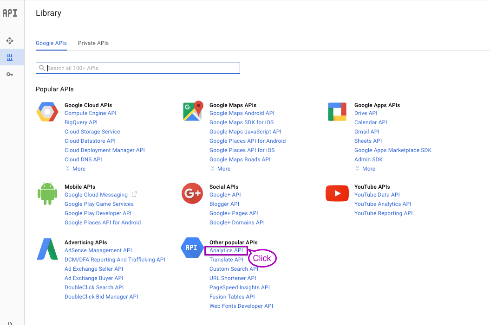
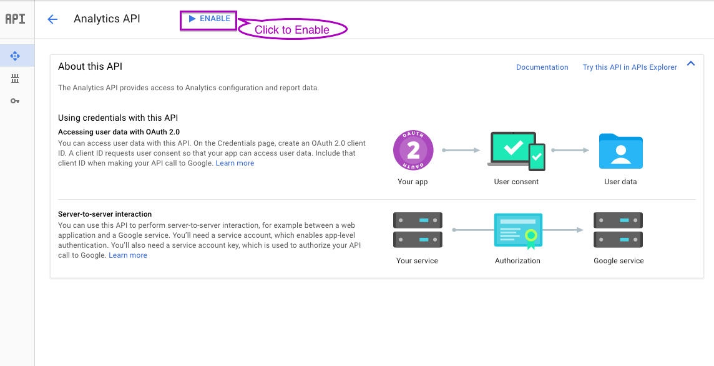
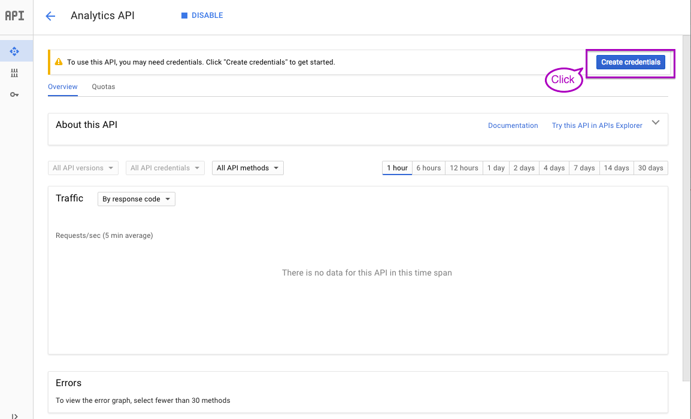
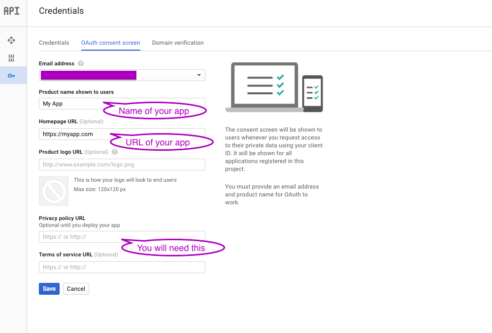
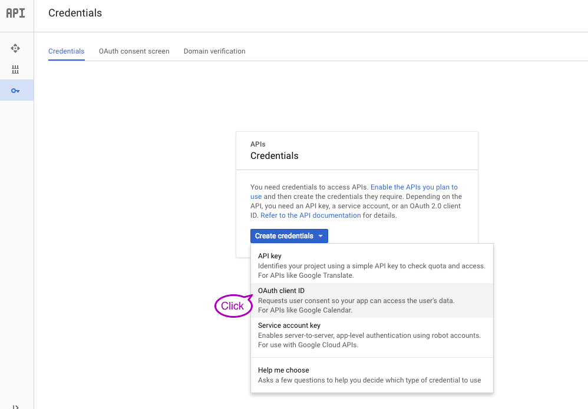
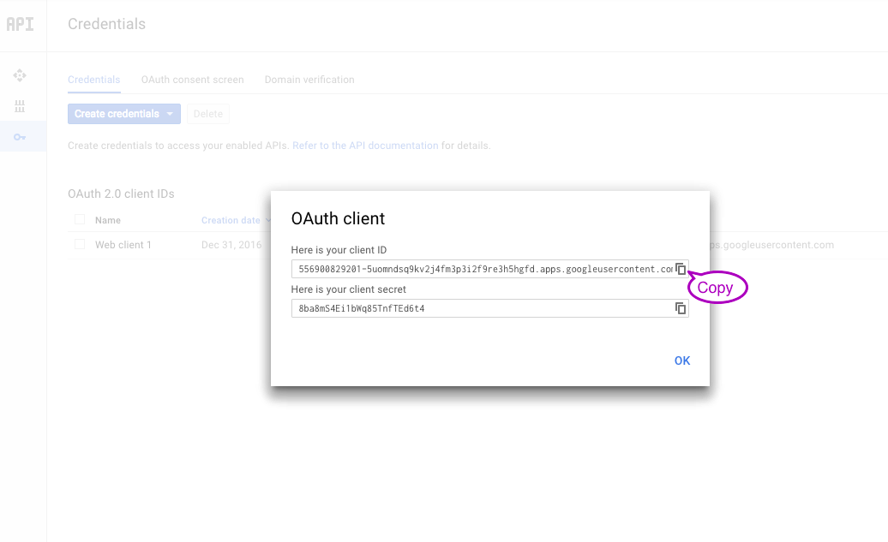

# angular-gapi-analyticsreporting


## Table of Contents

1. [Installation](#Installation)
2. [Update API Credentials](#update-api-credentials)
3. [Getting Started](#getting-started)
4. [Detailed Services and Functions](#Detailed-Services-and-Functions)
5. [Contribute](#contribute)


## Installation


#### Core Installation

Install via bower


```bash
bower install angular-gapi-analyticsreporting
```

Then add dependencies into your index.html


```html
<script src="bower_components/angular-gapi-analyticsreporting/ngar.js"></script>
```

Finally add the dependencies to your module

```javascript
var myApp = angular.module('myApp',
  [ // other dependencies
    'angularGapiAnalyticsreporting'
  ]
);
```

#### Installation with UI elements

Install via bower


```bash
bower install angular-gapi-analyticsreporting-material-ui
```

Then add dependencies into your index.html

```html
<link rel="stylesheet" href="bower_components/angular-material/angular-material.css" />
<link rel="stylesheet" href="bower_components/angular-gapi-analyticsreporting-material-ui/ngarMaterialUi.css" />
```

```html
<script src="bower_components/angular-gapi-analyticsreporting/ngar.js"></script>
<script src="bower_components/angular-material/angular-material.js"></script>
<script src="bower_components/angular-gapi-analyticsreporting-material-ui/ngarMaterialUi.js"></script>
```

Finally add the dependencies to your module

```javascript
var myApp = angular.module('myApp',
  [ // other dependencies
    'ngMaterial',
    'angularGapiAnalyticsreporting',
    'angularGapiAnalyticsreportingUI'
  ]
);
```


## Update API credentials

add 'CLIENT_ID' constant to your angular module

```javascript
myApp.constant('CLIENT_ID', '1044610610585-5nopo43t8ekv9vvdfbi5p43fv4295uqr.apps.googleusercontent.com');
```

To get the OAuth Client ID :

1. Create and account then a project on [Google Cloud](https://console.developers.google.com)

2. Go to [API dashboard](https://console.developers.google.com/apis/dashboard) then select Analytics API


3. Enable the API

4. Create Credentials 

5. Create Consent Screen

6. Create OAuth Client ID 

7. Copy Client ID 


## Getting Started

The services can be used via macro functions or by using each services separately in case you'd want to control each details

### Macro Functions

##### Initialization:
init() will load all the API and return a promise with the account tree if the user is signed in

```javascript
// inject 'ngar' service
var initialize = function(){
  ngar.init().then(function(tree){
    console.log('ngar initialized', tree);
  });
};
```

##### Sign In:

If the user is not already signed in, you will need to have him click a button to run the authentification

`signIn()` needs to be triggered by a button click and will run the authentification
 and return a promise with the account tree if the user is signed in

```javascript

// inject 'ngar' service

var signIn = function(){
  ngar.signIn().then(function(status){
    console.log('signed in', status);
    $scope.$digest();
  }, function(error){
    console.log('error initializing signing in', error);
  });
};

```

##### Sign Out:

You can add a sign-out button binding to the signOut function

`signOut()` returns a promise with the signed-in status

```javascript
// inject 'ngar' service
var signOut = function(){
  ngar.signOut().then(function(){
    console.log('signed out');
    $scope.$digest();
  }, function(error){
    console.log('error initializing signing out', error);
  });
};
```

##### Get Data

```javascript
// inject 'ngar' service
var params = [{
  viewId : '123455',
  dateStart: moment().subtract(60, 'days').toDate(),
  dateEnd: moment().subtract(1, 'days').toDate(),
  dimensions: ['ga:date','ga:sourceMedium'],
  metrics: ['ga:sessions','ga:users']
},{
  viewId : '123456',
  dateStart: moment().subtract(30, 'days').toDate(),
  dateEnd: moment().subtract(1, 'days').toDate(),
  dimensions: ['ga:date','ga:country'],
  metrics: ['ga:pageviews']
}];

var getData = function(params){
  ngar.get(params).then(function(data){
    console.log(data);
  });
};

```


## Detailed Services and Functions

These are the lower level services and their APIs:

##### API loading service

```javascript

// inject 'ngarLoadService' service

ngarLoadService.loadAllApis().then(function(){
  console.log('all apis are loaded');
});


```

##### Authentification Service

this uses the auth2 object

```javascript

  ngarAuthService.initAuth().then(function(){
    console.log('Auth is initialized');
    // update DOM
    // $scope.$digest();
  }, function(error){
    console.log('error initialzing Auth', error);
  });

```
Sign-in and sign-out

```javascript

ngarAuthService.signIn().then(function(){
  console.log('signed in');
  // update DOM
  // $scope.$digest();
}, function(error){
  console.log('error signing in', error);
});


ngarAuthService.signOut().then(function(){
  console.log('signed out');
  // update DOM
  // $scope.$digest();
}, function(error){
  console.log('error signing out', error);
});

```

##### Management Service

```javascript

  ngarManagementService.init().then(function(){
    console.log('init done');
    // promise returns the managmentService items
    // but one can also use the API ngarManagementService.items
  });

```

management service includes following APIs:

Account Tree holding the account/property/views hierarchy
`ngarManagementService.items.accountsTree`

Segments available from the selected profile
`ngarManagementService.items.segments`

Metadata of the API holds all the dimensions and metrics available
`ngarManagementService.items.metadata`

Breadcrumbs of the view ID
`ngarManagementService.getBreadcrumbs(id)`


##### Report Service

    buildRequest
    getData
    updateViewId
    params
    request

##### Data Service

    parseData
    parsedData
    cleanData
    getItemsOfDimension


## Contribute

Contributions, suggestions and bug alerts very welcome !!

This project is generated with [yo angular generator](https://github.com/yeoman/generator-angular)
version 0.15.1.

Run `grunt` for building and `grunt serve` for preview.

Running `grunt test` will run the unit tests with karma.
